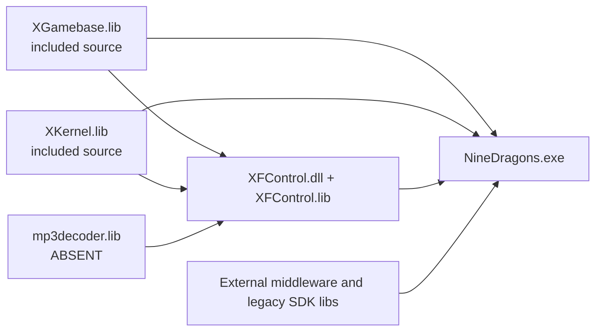

# US Player Link and ABI Closure

Date: 2026-07-25  
Scope: static inspection only; `US_Release|Win32`; no compilation or binary execution.

## Result

The normal player source/project closure is substantially better than the raw archive implied, but linker closure is **not yet complete**. The only newly confirmed non-system binary input that is wholly absent from the preserved player working tree is `mp3decoder.lib`. SpeedTree is a separately quarantined, strongly matching candidate rather than a provenance-confirmed dependency. The other staged middleware import libraries have the correct 32-bit decorated import style and expected DLL identity, but static symbol shape alone does not prove behavioral compatibility.

The first controlled build must not begin until the CRT/default-library contradiction and DirectX SDK selection are resolved deliberately. A successful forced link under arbitrary settings would not establish a faithful client.

## Internal build graph

Project references confirm the intended order:

1. `XGamebase/XGamebase.vcxproj` produces `Library/US/XGamebase.lib`.
2. `XKernel/XKernel.vcxproj` produces `Library/US/XKernel.lib`.
3. `XFControl/XFControl.vcxproj` references both projects and produces `Game/US/XFControl.dll` plus `Library/US/XFControl.lib`.
4. `EmperorOfDragons.vcxproj` references all three and produces `Game/US/NineDragons.exe`.

This graph concerns the normal player only. GM translation units and `*_GM.lib`/`NineDragons_GM.exe` outputs are not player dependencies.

## External-link closure

| Input | Archive-relative expected path | Status | Static compatibility evidence | Remaining risk / action |
|---|---|---:|---|---|
| Bink import library | `Library/BinkSDK/binkw32.lib` | Staged | COFF archive; 32-bit stdcall imports; names `binkw32.dll` | Preserve paired DLL; API-call comparison remains advisable |
| Bink runtime | `Library/BinkSDK/binkw32.dll` | Staged | Paired with import library | Runtime behavior not executed |
| FMOD import library | `Library/FMod/fmodvc.lib` | Staged | COFF archive; 458 stdcall-shaped imports; names `fmod.dll` | User-supplied `fmod.dll` has not been placed in this preserved tree |
| QHTM import library | `Library/QHTM/QHTM.lib` | Staged | COFF archive; 30 stdcall-shaped imports; names `QHTM.dll` | Paired staged DLL exists; runtime behavior not tested |
| XWebPage import library | `Library/CWebPage/XWebPage.lib` | Staged | COFF archive; 12 stdcall-shaped imports; names `XWebPage.dll` | User-supplied DLL has not been placed in this preserved tree |
| RAD static library | `Library/radsdk/radsdk6.lib` | Staged | COFF static archive with 1,556 defined symbols | Exact compiler/CRT provenance remains uncertain |
| DbgHelp import library | `Library/dbghelp.lib` | Staged | COFF archive; names `dbghelp.dll` | Prefer matching historical Windows SDK rather than this file merely existing |
| SpeedTree import library | linker search path: `SpeedTreeRT.lib` | Candidate only | Candidate import library and supplied DLL match 146/146 exports; wrapper API coverage is exact | Keep quarantined until provenance/licensing and chosen placement are recorded |
| MP3 decoder static/import library | `XFControl/mp3decoder.lib` or a configured library directory | **Absent** | Headers expose the exact API consumed by `XFControl/mp3decoder.cpp` | Critical for current `FLASHMP3` configuration; obtain the original library or plan an ABI-compatible replacement |
| DirectX 9 SDK libraries | external SDK | Absent from tree, expected externally | Project names `dxguid`, `d3d9`, `d3dx9`, `d3dx9dt`, `dsound`, `dinput8`, `dxerr9`, `d3dxof` | Requires a deliberate legacy DirectX SDK selection |
| Windows platform libraries | external SDK | Expected externally | Standard Win32 names | Use the preservation toolchain’s compatible Platform SDK |

## Confirmed `mp3decoder.lib` role

`XFControl` is built with `FLASHMP3`. Its included `mp3decoder.cpp` is a wrapper used by the Flash playback code, not the decoder implementation itself. It calls the functions declared in:

- `XFControl/mp3decifc.h`
- `XFControl/mp3sscdef.h`
- `XFControl/mp3streaminfo.h`
- `XFControl/mpegbitstream.h`

The unresolved API includes `mp3decOpen`, `mp3decClose`, `mp3decReset`, `mp3decDecode`, `mp3decFill`, `mp3decGetInputFree`, and `mp3decSetInputEof`. Those implementations are expected from `mp3decoder.lib`, which every regional `XFControl` link configuration names but the working tree does not contain.

This library affects Flash/UI MP3 audio. It is not replaced by `fmod.dll`, and it should not be silently omitted while `FLASHMP3` remains enabled. A temporary feature disable could help isolate later diagnostics, but would change client behavior and is not the preservation solution.

## Configuration blockers

### 1. Contradictory CRT directives

All four primary US projects select `MultiThreadedDLL` (`/MD`). The main executable nevertheless:

- explicitly adds both `MSVCRT.LIB` and `LIBCMT.LIB`; and
- simultaneously places both names in `IgnoreSpecificDefaultLibraries`.

`XFControl` also ignores `LIBCMT.LIB`. This looks like historical/manual linker policy damaged or made ambiguous during project conversion. It must be reconstructed from the older `.dsp`/`.mak` lineage and any original successful link log. Do not “fix” this merely by removing whichever diagnostic appears first.

### 2. Release configuration requests a debug-flavoured D3DX library

`US_Release` names both `d3dx9dt.lib` and `d3dx9.lib`. The `dt` input is suspicious in a release link and may be a stale regional/conversion artifact. The exact DirectX SDK vintage and original linker resolution order must be established before restoration.

### 3. Toolset ABI

The converted projects advertise a modern `v142` route, but the source and proprietary middleware originated in the Visual C++ 6 / early Visual C++ lineage. COFF import libraries are often portable across MSVC generations; static C++ libraries are not automatically so. `radsdk6.lib` is therefore higher ABI risk than plain C import libraries. The preservation route should start with the historically closest viable x86 compiler/toolset, then compare behavior before modernization.

### 4. Runtime placement is not link closure

The user has supplied `fmod.dll`, `XWebPage.dll`, `SpeedTreeRT.dll`, `QHTM.dll`, and `binkw32.dll` outside the repository. Runtime DLL availability does not supply missing headers/import libraries/static libraries and does not prove that the staged import library is the correct mate. They should remain evidence inputs until hashed, paired, and placed via a recorded dependency manifest.

## Current criticality

| Finding | Link impact | Functional impact | Classification |
|---|---:|---:|---|
| `mp3decoder.lib` absent | Blocks `XFControl` as currently configured | Flash/UI MP3 playback | Confirmed critical dependency gap |
| SpeedTree candidate not promoted | Blocks main link unless a library path supplies it | Vegetation rendering | Strong technical match; provenance decision pending |
| Legacy DirectX 9 SDK absent | Blocks main link | Renderer/input/audio helpers | Expected external SDK gap |
| CRT directives contradictory | May cause unresolved/duplicate runtime symbols or unsafe forced resolution | Heap/FILE/exception ownership across modules | Configuration blocker |
| Runtime FMOD/XWebPage DLLs not staged | Does not block link | Startup or feature load can fail | Later runtime packaging item |
| Three inferred tree textures absent | No link effect | Limited missing vegetation texture visuals | Non-blocking data defect |

## Gate before any controlled build

1. Acquire and hash the exact historical `mp3decoder.lib`, preferably from the same client/SDK lineage; compare its decorated exports against `mp3decifc.h`.
2. Record provenance and legal status for the candidate SpeedTree SDK files before promoting them into the player tree.
3. Identify the original DirectX 9 SDK vintage and explain the `d3dx9dt.lib` reference.
4. Reconstruct the CRT/default-library policy from the VC6 projects and surviving link logs.
5. Pair every import library to its runtime DLL by DLL identity and complete symbol-set comparison.
6. Freeze a preservation compiler/linker matrix. Only after that should a controlled build be proposed.

## Verdict adjustment

Source completeness for the normal player remains high: no additional missing proprietary player `.cpp`, `.h`, or resource was found in this pass. Link readiness is lower because `mp3decoder.lib`, the selected DirectX SDK, SpeedTree promotion, and linker-policy reconstruction remain open. This finding does **not** justify a claim that the client can yet be linked, started, or used correctly.
