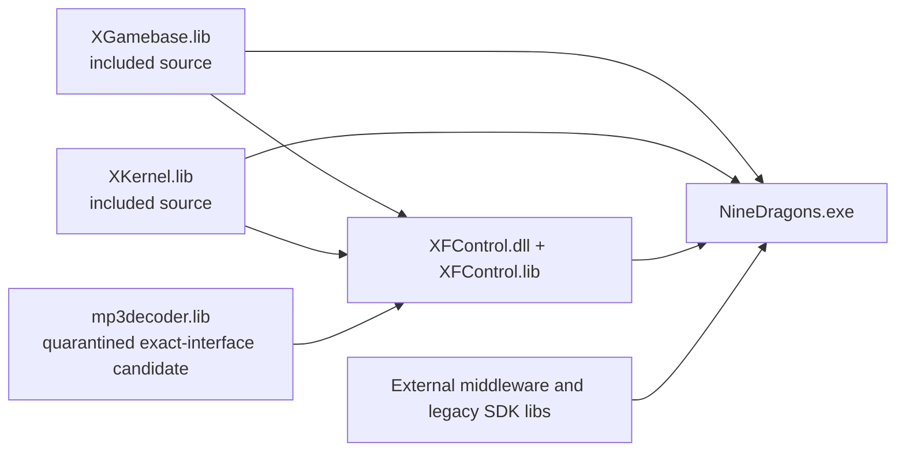

# US Player Link and ABI Closure

Date: 2026-07-25  
Scope: static inspection only; `US_Release|Win32`; no compilation or binary execution.

## Result

The normal player source/project closure is substantially better than the raw archive implied, but linker closure is **not yet complete**. A very strong public candidate for the previously absent `mp3decoder.lib` has now been located, but is not promoted into the preserved tree pending provenance/licensing review. SpeedTree is likewise a separately quarantined, strongly matching candidate rather than a provenance-confirmed dependency. The other staged middleware import libraries have the correct 32-bit decorated import style and expected DLL identity, but static symbol shape alone does not prove behavioral compatibility.

The first controlled build must not begin until the historical mixed-CRT
policy and DirectX SDK selection are resolved deliberately. A successful
forced link under arbitrary settings would not establish a faithful client.

The Flash/XFControl chain is technically closed except for the decoder's
licensing/provenance decision. `Library/US/XFControl.lib` is generated output,
the reference DLL has the exact consumed export, and all normal-US SWFs are
present; see `US-PLAYER-FLASH-XFCONTROL-END-TO-END-CLOSURE.md`.

## Internal build graph

Project references confirm the intended order:

1. `XGamebase/XGamebase.vcxproj` produces `Library/US/XGamebase.lib`.
2. `XKernel/XKernel.vcxproj` produces `Library/US/XKernel.lib`.
3. `XFControl/XFControl.vcxproj` references both projects and produces `Game/US/XFControl.dll` plus `Library/US/XFControl.lib`.
4. `EmperorOfDragons.vcxproj` references all three and produces `Game/US/NineDragons.exe`.

This graph concerns the normal player only. GM translation units and `*_GM.lib`/`NineDragons_GM.exe` outputs are not player dependencies.

## External-link closure

| Input | Archive-relative expected path | Status | Static compatibility evidence | Remaining risk / action |
|---|---|---:|---|---|
| Bink import library | `Library/BinkSDK/binkw32.lib` | Present but inactive | IGA/Bink source is guarded by absent `_ACCLAIM_IGAADSYSTEM` | Remove from future normal-player link line |
| Bink runtime | `Library/BinkSDK/binkw32.dll` | Not required | Reference EXE has no Bink import | Exclude from normal-player runtime manifest |
| FMOD import library | `Library/FMod/fmodvc.lib` | Active and paired | All 229 required APIs exist in supplied DLL; FMOD 3.74 header | Retain; DLL awaits runtime-manifest placement and `SR_SOUND.XP` is present |
| QHTM import library | `Library/QHTM/QHTM.lib` | Active and paired | Exact 16-ordinal DLL match; unconditional initialization and HTML-to-texture calls | Retain for preservation baseline |
| XWebPage import library | `Library/CWebPage/XWebPage.lib` | Active and paired | Exact 6-function DLL match; active US Rubicon/browser calls | Retain initially; paired DLL awaits runtime-manifest placement |
| RAD static library | `Library/radsdk/radsdk6.lib` | Present but inactive | All calls are under absent `_ACCLAIM_IGAADSYSTEM`; reference EXE lacks RAD signatures | Remove from normal-player link line; not a normal-player CRT/ABI blocker |
| DbgHelp import library | `Library/dbghelp.lib` | Staged | COFF archive; names `dbghelp.dll` | Prefer matching historical Windows SDK rather than this file merely existing |
| SpeedTree import library | linker search path: `SpeedTreeRT.lib` | Technically closed; quarantined | Exact 146/146 DLL match, exact wrapper coverage, reference-matching authorization and complete core packs | Provenance/licensing and controlled placement remain |
| MP3 decoder static library | `XFControl/mp3decoder.lib` or a configured library directory | Exact-lineage candidate quarantined; not promoted | COFF i386, all 11 exact stdcall exports, three byte-identical headers, and all 19 meaningful diagnostics match reference `XFControl.dll` | Binary/ABI gap closed; proprietary licensing and CRT treatment remain |
| DirectX 9 SDK libraries | external SDK | Absent from tree, expected externally | Project names `dxguid`, `d3d9`, `d3dx9`, `d3dx9dt`, `dsound`, `dinput8`, `dxerr9`, `d3dxof` | Requires a deliberate legacy DirectX SDK selection |
| Windows platform libraries | external SDK | Expected externally | Standard Win32 names | Use the preservation toolchain’s compatible Platform SDK |

## Confirmed `mp3decoder.lib` role

`XFControl` is built with `FLASHMP3`. Its included `mp3decoder.cpp` is a wrapper used by the Flash playback code, not the decoder implementation itself. It calls the functions declared in:

- `XFControl/mp3decifc.h`
- `XFControl/mp3sscdef.h`
- `XFControl/mp3streaminfo.h`
- `XFControl/mpegbitstream.h`

The unresolved API includes `mp3decOpen`, `mp3decClose`, `mp3decReset`, `mp3decDecode`, `mp3decFill`, `mp3decGetInputFree`, and `mp3decSetInputEof`. Those implementations are expected from `mp3decoder.lib`, which every regional `XFControl` link configuration names but the working tree does not contain.

This library affects Flash/UI MP3 audio. It is not replaced by `fmod.dll`, and it should not be silently omitted while `FLASHMP3` remains enabled. A temporary feature disable could help isolate later diagnostics, but would change client behavior and is not the preservation solution.

### Located candidate

A public repository contains an actual binary at:

`playbar/nstest@d56141912bc2b0e22d1652aa7aff182e05142005:dependency/mp3decoder/lib/mp3decoder.lib`

Source URL:

`https://github.com/playbar/nstest/blob/d56141912bc2b0e22d1652aa7aff182e05142005/dependency/mp3decoder/lib/mp3decoder.lib`

SHA-256:

`3d27b37d6bf9ba95d8d3f5e1c75c1256b0759f76f6980627dbd936f25bd9558c`

Static validation:

- every object member is `coff-i386`;
- all 11 functions declared by the client interface are present with exact Win32 stdcall decoration and byte counts:
  `_mp3decOpen@20`, `_mp3decClose@4`, `_mp3decReset@4`,
  `_mp3decDecode@16`, `_mp3decGetStreamInfo@4`, `_mp3decFill@16`,
  `_mp3decGetInputFree@8`, `_mp3decGetInputLeft@8`,
  `_mp3decSetInputEof@4`, `_mp3decIsEof@4`, and
  `_mp3decGetErrorText@8`;
- candidate `mp3decifc.h` SHA-256
  `de3f9cda204ee31a1cf02e0a21ee11bcbb34cc810fcb36fec6dcc31f58bfb666`
  is byte-identical to `XFControl/mp3decifc.h`;
- candidate `mp3sscdef.h` SHA-256
  `7fba93084da68280d227f24dc0fc14156d3bd29dbcfd9df732be8fa8143ed4a0`
  is byte-identical to `XFControl/mp3sscdef.h`;
- candidate `mp3streaminfo.h` SHA-256
  `28d4a2df8c62aecbf7fe62a3b10aa23217e46c7c54f3637dce781f0e71193630`
  is byte-identical to `XFControl/mp3streaminfo.h`;
- embedded paths identify the implementation lineage as
  `D:\code\mp3decoder\mp3decoder\corelibs\mp3dec`;
- public Flash source evidence places the same API under the historical
  Macromedia/Fraunhofer `fhdecoder` tree.

Technical match confidence is therefore **98–100% at the declared API/ABI
surface**. It is not yet a 100% provenance or behavior verdict. In particular,
the archive contains `.drectve` defaults for `LIBCMT`/`LIBCMT.lib`, indicating
a static CRT build. That provides a plausible explanation for the unusual CRT
suppression in the client project, but also means the final linker policy must
be reconstructed carefully.

## Configuration blockers

### 1. Historical mixed-CRT directives

All four primary US projects select `MultiThreadedDLL` (`/MD`). The main executable nevertheless:

- explicitly adds both `MSVCRT.LIB` and `LIBCMT.LIB`; and
- simultaneously places both names in `IgnoreSpecificDefaultLibraries`.

`XFControl` also carries unusual CRT suppression. The dedicated
`CRT-LINKER-POLICY-AUDIT.md` establishes that this predates project conversion:
the original VC6 `.dsp` files contain the same arrangement. The likely intent
was `/MD` for player code while satisfying old static objects. The remaining
demonstrated boundary is `mp3decoder.lib`; `radsdk6.lib` is inactive in the
normal player. The exact effect of the original quoted
two-name `/NODEFAULTLIB` argument remains to be proven. Do not “fix” this merely
by removing whichever diagnostic appears first.

### 2. Release configuration retains an obsolete D3DX library

`DIRECTX-SDK-LINEAGE-AUDIT.md` establishes that the included headers are D3DX
SDK version 43 and the converted lineage names the June 2010 SDK.
`d3dx9dt.lib` was a pre-February-2005 statically linked debug D3DX library and
appears across every region/configuration in the VC6 project. The supplied
reference EXE contains its characteristic debug assertions and Microsoft
`nt32_chk` D3DX source paths, so it was genuinely embedded in that historical
derivative. The fidelity route must retain a validated early `d3dx9dt.lib`;
the coherent June 2010 route deliberately omits it and records the deviation.

### 3. Toolset ABI

The converted projects advertise a modern `v142` route, but the source and
proprietary middleware originated in the Visual C++ 6 / early Visual C++
lineage. COFF import libraries are often portable across MSVC generations;
static C++ libraries are not automatically so. The active Flash decoder
boundary therefore deserves more care than plain C import libraries.
`radsdk6.lib` would be high ABI risk if enabled, but it is not part of normal
US player closure. The preservation route should start with the historically
closest viable x86 compiler/toolset, then compare behavior before modernization.

### 4. Runtime placement is not link closure

The user supplied `fmod.dll`, `XWebPage.dll`, `SpeedTreeRT.dll`, `QHTM.dll`,
and `binkw32.dll`. They have since been statically paired against their import
libraries. Bink is excluded from the normal-player runtime set because its
feature is inactive; the other four remain runtime-manifest inputs pending
controlled placement.

## Current criticality

| Finding | Link impact | Functional impact | Classification |
|---|---:|---:|---|
| `mp3decoder.lib` candidate not promoted | Blocks an XFControl source rebuild until an authorized or clean-room implementation is selected | Flash/UI MP3 playback | 99–100% technical lineage; Fraunhofer rights pending; normal US CRT policy reconstructed |
| SpeedTree candidate not promoted | Blocks main link only until reviewed placement | Vegetation rendering; three localized inferred textures absent | Technical set is 98–99% matched; provenance decision pending |
| October 2004 VC6 D3DX set quarantined, not promoted | Blocks main link until reviewed placement | Renderer helpers | Exact coherent Microsoft main-SDK plus VC6 Extras set recovered |
| US `XFControl` CRT text malformed in converted project | Must be normalized before link | Decoder/runtime boundary | Policy resolved as `/MD`, ignore `LIBCMT` only; verbose-link proof pending |
| Runtime FMOD/XWebPage DLLs not staged | Does not block link | Startup or feature load can fail | Later runtime packaging item |
| Three inferred tree textures absent | No link effect | Limited missing vegetation texture visuals | Non-blocking data defect |

## Gate before any controlled build

1. Keep the exact-lineage `mp3decoder.lib` quarantined unless documentary
   authorization is obtained; otherwise plan a clean-room API-compatible
   decoder adapter.
2. Record provenance and legal status for the candidate SpeedTree SDK files before promoting them into the player tree.
3. Review the recovered coherent Microsoft October 2004 main-SDK plus VC6
   Extras set for controlled placement; keep this fidelity path separate from
   any June 2010 maintenance path.
4. Apply the reconstructed US `XFControl` policy only in a gated future patch:
   `/MD`, ignore `LIBCMT.LIB` only, retain `MSVCRT`, and require verbose-link
   and map evidence.
5. Pair every import library to its runtime DLL by DLL identity and complete symbol-set comparison.
6. Freeze a preservation compiler/linker matrix. Only after that should a controlled build be proposed.

## Verdict adjustment

Source completeness for the normal player remains high: no additional missing proprietary player `.cpp`, `.h`, or resource was found in this pass. The exact October 2004 VC6 D3DX set is now recovered in quarantine. Link readiness remains gated by reviewed dependency promotion, coherent DirectX companion/header selection, `mp3decoder.lib`, SpeedTree promotion, and linker-policy reconstruction. This finding does **not** justify a claim that the client can yet be linked, started, or used correctly.

A fresh four-project path scan later identified
`XKernel/XSecurity/XCrypto.Cpp` as absent from the assembled working tree. The
exact 499-line file is present in the authoritative archive with SHA-256
`c78a0ce9eb0285c584a34c70ee637397417568cf4c975973cce443933da4160f`.
This is a fully recoverable assembly omission, not unavailable source. See
`NORMAL-US-PLAYER-REMAINING-GAPS-LEDGER.md`.

The complete static import-library/runtime pairing results are recorded in
`RUNTIME-DLL-PAIRING-AUDIT.md`. FMOD, QHTM, XWebPage and SpeedTreeRT have
compatible supplied DLLs at the PE import/export boundary. Bink also pairs
technically but is not required by normal US Release. Provenance, approved
placement and runtime behavior remain separate gates.

The frozen preservation and modernization choices are recorded in
`PRESERVATION-TOOLCHAIN-MATRIX.md`. The primary preservation reference is VC6
SP6 x86 with the original project lineage and June 2010 DirectX SDK x86
components. The existing `v142` conversion is retained as a diagnostic and
later modernization route, not treated as ABI-equivalent.
