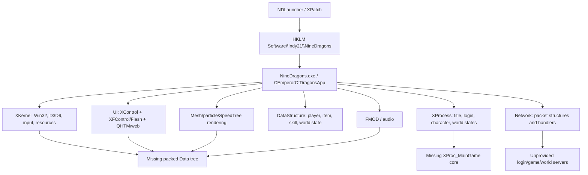

# Emperor of Dragons Client Source Forensic Audit

> **Supplemental lineage analysis:** A complete static comparison against
> `osfarrapos/spree/project2` is recorded in
> [emperor-of-dragons-github-lineage-and-gap-analysis.md](emperor-of-dragons-github-lineage-and-gap-analysis.md).
> It establishes that the GitHub tree is an older close ancestor/sibling,
> separates normal-player and GM dependencies, and inventories every
> GitHub-only path. No files have been merged into the client source.
>
> A quarantined, non-building virtual overlay and its reassessment are recorded
> in
> [../recovery/emperor-of-dragons-normal-client-overlay/REASSESSMENT.md](../recovery/emperor-of-dragons-normal-client-overlay/REASSESSMENT.md).
> It does not alter the archive tree.

**Audit date:** 25 July 2026  
**Primary baseline:** `US_Release|Win32`  
**Intended use:** candidate source for a future Heavenfall game client  
**Method:** static inspection only; no archived executable, script, installer, packer, launcher, anti-cheat module, compiler, or linker was run

## Executive conclusion

The archive is a large but incomplete native Windows C/C++ client source snapshot for **Nine Dragons / Emperor of Dragons**, not a self-contained build or a deployable game client.

The strongest evidence identifies:

- an original **Microsoft Visual C++ 6.0 / MSVC 12.00** codebase;
- later conversion through **Visual Studio 2008**, **Visual Studio 2017 (v141)**, and **Visual Studio 2019 (v142)**;
- a **32-bit x86 Win32 GUI application**, Multi-Byte Character Set, Direct3D 9;
- the legacy **DirectX SDK (June 2010), D3DX SDK version 43**;
- a regional build matrix for KR, US, JP, CN, TW, TH, VN, and RS, with release, debug, release-debug, GM, and test variants;
- substantial engine, rendering, packet, UI, launcher, patcher, and tool source;
- no complete US linker dependency set, no central `XProc_MainGame` implementation/header set, no runtime DLL set, and almost no game data.

The archive cannot currently produce the intended US client. More importantly, even a forced or stubbed successful build would not constitute a correct Heavenfall client. The source contains the shape of a client protocol and game, but the supplied evidence does not establish a matching Heavenfall server protocol, authentication exchange, packet structure version, encryption state, content revision, launcher contract, or asset set.

### Bottom-line viability from this archive alone

| Outcome | Estimated probability | Confidence | Why |
|---|---:|---|---|
| Produce a linked `NineDragons.exe` | **10–25%** | High | Central source and at least eight non-system US link inputs are absent. Some internal libraries can be rebuilt, but proprietary middleware and main-game code cannot be inferred safely. |
| Reach stable local process startup | **5–15%** | High | No runtime DLL set and no complete data tree; registry, DirectX, D3DX, FMOD, Bink/RAD, SpeedTree, and launcher assumptions remain. |
| Render the authentic login/UI flow | **3–10%** | High | UI source exists, but required textures, Flash content, fonts, scripts, QHTM/web code/library, and startup process code are incomplete or absent. |
| Load complete game data | **0–5%** | High | Required packed model, texture, environment, script, sound, font, and table data is not in the archive. |
| Connect and authenticate to Heavenfall | **0–5%** | Medium-high | Packet/login source exists, but there is no matching Heavenfall server source, protocol capture, credential flow, key material, or authoritative endpoint configuration. |
| Enter and play correctly in the game world | **0–2%** | High | Missing main-game process, data, middleware, server contract, and reference runtime make functional equivalence unprovable. |

These ranges describe the supplied archive in isolation. They are not a prediction that the project is permanently unrecoverable. A known-good matching client distribution, its complete `Data` tree and runtime DLLs, and matching server/protocol evidence could change the assessment materially.

## 1. Evidence integrity and archive structure

### 1.1 Authoritative input

| Item | Result |
|---|---|
| Input | `EmperorOfDragons.zip` |
| ZIP SHA-256 | `4b2daf495fdc7aa5a13f7ee0f784157c2a3877deb12a9923d5c5ac9f10a6bda7` |
| ZIP contents | One uncompressed/store-only member: `EmperorOfDragons.rar` |
| Inner RAR size | 408,285,747 bytes |
| Inner RAR SHA-256 | `6533ca3b384bc696d7cd7b19bfcbe96411b824fe88a1e23d93d1fa3633f2c61d` |
| RAR format | RAR 5.0, Windows host metadata |
| Extracted files | **3,810** |
| Extracted directories | **274** |
| Extracted size | Approximately **1.7 GiB** |

The extracted file count exactly matches the RAR file inventory. Inspection used a temporary extraction outside the Heavenfall workspace. The archived source was not modified.

### 1.2 Apparent age

File timestamps are heterogeneous:

- 2,122 files date to 4 July 2012;
- 519 date to 14 November 2017;
- 388 source/build artefacts date across 2019–2020;
- a small number date from 2004–2008 and 2021–2022;
- four container/top-level entries carry 2026 timestamps.

Timestamps therefore describe repacking, copying, and later conversion as well as authorship. They cannot be treated as a clean source-control history. Visual SourceSafe remnants (`vssver2.scc`, `mssccprj.scc`) and local Visual Studio databases are present, but no repository history is included.

### 1.3 Inventory by file type

| Extension/type | Count | Interpretation |
|---|---:|---|
| `.h` | 990 | C/C++ headers, including duplicated SDK trees |
| `.cpp` | 857 | C++ implementation |
| `.c` | 113 | C libraries, principally codec/image/compression support |
| `.obj` | 388 | Partial historical x86 COFF build outputs |
| `.sbr` | 392 | Visual C++ source-browser outputs |
| `.html` / `.htm` | 182 | SDK documentation and conversion reports |
| `.bmp` / `.jpg` / `.gif` | 209 | Mostly tool/UI resources, not the game content set |
| `.lib` | 19 | Small, incomplete subset of required static/import libraries |
| `.dll` | **0** | No runtime DLL distribution |
| `.exe` | 3 | Archived tools only; not executed |
| `.vcxproj` / `.vcproj` / `.dsp` | 44 | Converted and original project definitions |
| `.sln` / `.dsw` / `.mak` | 17 | Solutions, VC6 workspaces, one exported VC6 makefile |
| `.pdb` | 11 | Partial compiler databases |
| `.swf` | 4 | Launcher faction resources only |
| `.xp` | 1 | `XLauncher/IMageResource/XLAUNCHER.XP`; not the game data set |
| nested `.rar` | 3 | Source duplicates/backups for XGamebase and XKernel |

### 1.4 Inventory by top-level subsystem

| Subsystem | Files | Notes |
|---|---:|---|
| `XLauncher` | 671 | MFC launcher, Flash controller copy, patch/network code and build outputs |
| `Compiled` | 592 | Partial JP/KR objects, logs, PDBs and browser data |
| `audio_sdk` | 450 | GAP audio system source, headers, docs and libraries; client selects FMOD instead |
| `XProcess` | 321 | Login, selection, loading, gameplay windows and state processes; core main-game files missing |
| `qhtm sdk` | 288 | QHTM source and docs, separate from missing configured `Library/QHTM/QHTM.lib` |
| `XPacker` | 226 | XP archive tooling and bundled Zip libraries |
| `XKernel` | 182 | Direct3D, input, windowing, resources, registry, exception and utility layer |
| `XGamebase` | 176 | image, compression, bitmap, system and utility static library |
| `SetRegistry` | 94 | server/registry setup utility, with duplicate nested source |
| `XPatch` | 90 | patch utility; incomplete project references |
| `DataStructure` | 83 | characters, items, skills, world state and global data |
| `XFControl` | 81 | Flash/SWF rendering and sound control DLL source |
| `XFileTransfer` | 73 | FTP and ZIP transfer utility |
| `Network` | 53 | socket/request layer and extensive packet structures/handlers |
| `MeshControl` | 47 | D3D mesh, terrain, animation, grass, water, post-processing |
| `Resource` | 45 | source-level UI resources, not runtime game packages |
| `NMClass` | 37 | Nexon messaging/authentication client wrappers and two libraries |
| `Script` | 36 | client scripting support |
| `XParticleCore` | 22 | particle engine |
| `ShaderCode` | 21 | vertex/pixel shader source |
| `NexonADBalloonLib` | 16 | Korean Nexon advertising component |
| `XSTreeWrapper` | 14 | SpeedTree wrapper/wind code; SpeedTree runtime absent |

## 2. What it was built with

### 2.1 Project lineage

The history is confirmed rather than inferred:

1. `EmperorOfDragons.dsp` declares `Microsoft Developer Studio ... Format Version 6.00` and `Win32 (x86) Application`.
2. `EmperorOfDragons.mak` is an exported Visual C++ 6 NMAKE project. Early rules use `/ML` or `/MLd`, `/GX`, `/O2`, `/machine:I386`, and DirectX 8-era inputs.
3. Embedded object/library strings contain `Microsoft (R) 32-bit C/C++ Optimizing Compiler Version 12.00.8168.0`, the Visual C++ 6 compiler.
4. `EmperorOfDragons.vcproj` is Visual Studio 2008 format (`Version="9.00"`) and explicitly inherits `UpgradeFromVC60.vsprops`.
5. backup solutions record Visual Studio 2008 and Visual Studio 2017.
6. 2017 build traces name MSVC `14.16.27023`, `v141`, native 32-bit tools, and Windows SDK 8.1.
7. the current solution records Visual Studio 15, while the current projects have been retargeted to `PlatformToolset=v142` (Visual Studio 2019). Another backup solution records Visual Studio 16.

This is not a clean VS2019-native source tree. It is a VC6 program repeatedly upgraded in place.

### 2.2 Primary US configuration

`US_Release|Win32` resolves to:

| Setting | Value |
|---|---|
| Output | `Game/US/NineDragons.exe` |
| Architecture | Win32/x86 (`TargetMachine=MachineX86` in the prior project) |
| Application type | Native Windows GUI application |
| Current compiler toolset | MSVC `v142` |
| Character set | MultiByte/MBCS |
| C++ standard | Unspecified, therefore the compiler's legacy/default mode |
| Optimization | Max speed, string pooling, function-level linking |
| Warning level | `/W3` |
| Precompiled header | `stdafx.h` |
| CRT model | `MultiThreadedDLL` (`/MD`) |
| Link mode | Non-incremental, `/SUBSYSTEM:WINDOWS`, reference optimization |
| Debug information | Disabled in current project |
| Resource culture | `0x0412` (Korean), even for the US target |
| MFC | Main client: no MFC; launcher/tools use MFC |

US-specific definitions are:

```text
NDEBUG
WIN32
_WINDOWS
NOUSE_VORBIS
NOUSE_WMA
_XUSEFMOD
_XNOCHECKMEMORYUSAGE
_XESTABLISHEDSERVER
_NEW_TYPE
_ACCLAIM_VERSION
_XENGLISH
_ACCLAIM_RUBICONADSYSTEM
_X_US_EXPANDSERVERLIST
```

The linker simultaneously names `msvcrt.lib` and `libcmt.lib`, then ignores both as defaults. This is historical CRT-conflict management, not a healthy modern configuration. Imported libraries carry mixed runtime directives. Any restoration must audit allocator ownership and CRT crossings before changing this.

### 2.3 DirectX and graphics toolchain

The active renderer is Direct3D 9:

- headers and code use `IDirect3D9`, `D3DCAPS9`, D3D9 textures, D3DX matrices, sprites, fonts and shader versions;
- link inputs include `d3d9.lib`, `d3dx9.lib`, `d3dx9dt.lib`, `dxguid.lib`, `dinput8.lib`, `dsound.lib`, `dxerr9.lib`, and `d3dxof.lib`;
- `XKernel/d3dx9core.h` defines `D3DX_SDK_VERSION 43`;
- project paths explicitly name `DXSDK (June 2010)`.

Therefore the required legacy SDK is **Microsoft DirectX SDK (June 2010)**, x86 libraries, including the debug D3DX library where configured. A current Windows SDK alone does not provide the removed D3DX/DXErr/D3DXOF components.

### 2.4 Compiler and linker recommendation

There are two different goals and they must not be conflated.

#### Preservation/reference toolchain

Use an isolated 32-bit Windows VM and preserve:

1. **Visual C++ 6.0 SP6 compiler/linker** as the historical ABI reference;
2. **Visual Studio 2008** to interpret the first converted regional matrix;
3. **Visual Studio 2017 15.9, MSVC 14.16/v141, Windows SDK 8.1** as the last environment explicitly evidenced by detailed build traces;
4. **DirectX SDK June 2010** x86 headers/libraries.

The first controlled build should initially use **VS2017 v141 + Windows 8.1 SDK + DXSDK June 2010**, not because it is guaranteed correct, but because the later source/project state and surviving US `XGamebase.lib` contain modern MSVC compatibility metadata while the archive also records this exact environment. VC6 is the ABI/reference comparator for older third-party libraries and original behaviour.

Do not use the present `v142` tag as proof that VS2019 was a successful client toolchain. It is conversion metadata; no successful full US client build log or output exists.

#### Modernization toolchain

After a reference client is reproduced and regression-tested, migrate in controlled stages to current Visual Studio:

- keep Win32 first;
- replace D3DX/DXErr dependencies intentionally;
- normalize CRT use;
- make language conformance changes behind tests;
- replace or isolate proprietary middleware;
- only then consider x64 or renderer changes.

Moving directly to a current compiler changes layout/conformance, CRT behaviour, iterator/debug semantics, exception handling, deprecated API availability, and compatibility with old import/static libraries. It would produce a port, not evidence of historical correctness.

## 3. Client architecture



### 3.1 Entry and state flow

`EmperorOfDragons.cpp` and `EmperorOfDragons.h` define `CEmperorOfDragonsApp`, the application and Direct3D lifecycle. It owns process objects for title, login, character selection/creation, loading, zero-level/tutorial, server unification, and the main game.

The missing `XProcess/XProc_MainGame.h` is included directly by the application header, and the missing class is instantiated by value as `m_proc_maingame`. This is not an optional leaf feature. The existing 18,000-line `XProc_MainGameMessageHandler.cpp` implements member functions whose declarations and central lifecycle are absent. Safe reconstruction from that file alone is not realistic.

### 3.2 Renderer

Rendering is an in-house Direct3D 9 engine composed of:

- XKernel D3D application/device lifecycle;
- mesh, animation, terrain, grass, water and post-processing;
- shader source in `ShaderCode`;
- particle support;
- a SpeedTree runtime wrapper;
- packed textures/models/environments loaded from `.XP` containers.

The code checks vertex/pixel shader capabilities and contains fallback paths. It is still coupled to D3DX and legacy Direct3D helper code.

### 3.3 Network and protocol

The archive contains a meaningful protocol surface:

- `Network/Game_packets.h`;
- packet headers for login, lobby, levels, skills, items/trade, quests, party, organization, messenger, battle, bosses, events, cash items, server moves, XTrap, and zone/monster traffic;
- `XNetwork.cpp` and domain-specific handlers;
- request/socket code;
- MD5 implementation and `XKernel/XCrypto.h`, `XEncryptdata.h`, and `XEncryptor.h`.

This is valuable for protocol archaeology, but it is not a server contract. C/C++ packet structs may depend on packing, compiler layout, regional macros, integer sizes, and revision-specific conditionals. The archive provides no matching server build, schema/version manifest, authoritative packet capture, or integration test.

### 3.4 Launcher, patching and registry

The launcher receives server/patch information and writes values under:

```text
HKEY_LOCAL_MACHINE\Software\Indy21\NineDragons\
```

Values include server address/port, patch server/FTP configuration, patch number/version, graphics options, and binary `ndc info` server structures. `Game/Server.ini` is not text; it is a serialized binary structure containing the strings `eclipse`, `88.23.35.30`, and `94.23.35.30`. Pointer-like values are visible in the blob, suggesting it may be a raw or version-sensitive structure dump rather than a portable configuration format.

Hardcoded historical endpoints also exist, including:

- `login.cuulong.com.vn`;
- `72.3.184.153` as a RAD advertising/auth default;
- `221.147.34.23` as an FTP logging/test default;
- the addresses embedded in `Game/Server.ini`.

These are evidence of prior regional deployments, not valid Heavenfall endpoints. They must never be used as defaults.

### 3.5 UI, web and Flash

The client combines custom D3D UI, an embedded Flash/SWF renderer (`XFControl`), QHTM, Internet Explorer/MSHTML interfaces, WinInet, and a web-page library. The launcher has another Flash-control source copy. This creates compatibility and security risks on modern Windows, and several expected libraries/assets are absent.

### 3.6 Audio and video

The US configuration defines `_XUSEFMOD` and `NOUSE_VORBIS`/`NOUSE_WMA`, so its active sound path is FMOD, not the included GAP audio libraries. The configured `Library/FMod/fmodvc.lib` and runtime DLL are absent.

The US build uniquely enables Bink/RAD advertising/video support through `XIGAADWrapper`, `Library/BinkSDK`, and `Library/radsdk`. All configured Bink/RAD headers, source bridge and libraries are absent.

### 3.7 Anti-cheat and regional services

Source conditionals reference HackShield/HShield, GameGuard, XTrap and region-specific authentication/advertising services. The expected `HackDetector` tree is absent. No anti-cheat runtime modules are supplied. A private Heavenfall client should treat these as protocol/behavioural dependencies to understand, not blindly restore obsolete kernel/user-mode software.

## 4. Completeness analysis

### 4.1 Missing project-listed files

The main project lists 22 paths that do not exist. None is explicitly excluded from `US_Release|Win32` in the converted project.

| Missing archive-relative path(s) | Classification | US severity | Recoverability |
|---|---|---|---|
| `XProcess/XProc_MainGame.cpp` | Genuine proprietary/core source loss | **Blocker** | Requires another source snapshot; cannot be replaced faithfully with a stub |
| `XProcess/XProc_MainGameCallBackFunctions.cpp` | Genuine proprietary/core source loss | **Blocker** | Requires matching source |
| `XProcess/XProc_MainGame.h` | Genuine proprietary/core source loss | **Blocker** | Requires matching source |
| `XProcess/XProc_MainGameDef.h` | Genuine shared definitions loss | **Blocker** | Included by application, filtering, UI and data code |
| `XProcess/XWindow_GMCommand.{cpp,h}` | GM/admin source loss or stale unconditional item | High | May be removable from a non-GM target only after reference comparison |
| `XProcess/XWindow_GM_EventManager.{cpp,h}` | GM/admin source loss | Medium-high | Same condition |
| `XProcess/XWindow_GM_MonsterManage.{cpp,h}` | GM/admin source loss | Medium-high | Same condition |
| `XProcess/XWindow_GM_SendNoticeMessage.{cpp,h}` | GM/admin source loss | Medium-high | Same condition |
| `XProcess/XWindow_GM_StatusControl.{cpp,h}` | GM/admin source loss | Medium-high | Same condition |
| `XProcess/XWindow_GM_UserCoordination.{cpp,h}` | GM/admin source loss | Medium-high | Same condition |
| `Library/BinkSDK/dx9rad3d.cpp` | Third-party SDK bridge source | High for US | Recover only from the licensed matching Bink SDK |
| `Library/BinkSDK/bink.h` | Third-party SDK header | High for US | Matching licensed SDK/client source needed |
| `Library/BinkSDK/binktextures.h` | Third-party SDK header | High for US | Matching licensed SDK/client source needed |
| `Library/BinkSDK/rad3d.h` | Third-party SDK header | High for US | Matching licensed SDK/client source needed |
| `Library/BinkSDK/radbase.h` | Third-party SDK header | High for US | Matching licensed SDK/client source needed |
| `NMClass/ADBalloon.h` | Wrong/stale path | Low for US | A related file exists at `NexonADBalloonLib/ADBalloon.h`; US does not link the Nexon component |

Additional project defects outside the primary executable:

| Project | Missing items | Consequence |
|---|---|---|
| `XLauncher/XLauncher.vcxproj` | `XLauncherDlg.cpp` | Launcher project is incomplete or contains a stale renamed entry |
| `XPatch/XPatch.vcxproj` | ten `../WWIIStarter_FTP/Zip/*.h` files, `res/bitmap1.bmp`, `res/Border.rgn` | Patch tool cannot be reproduced as configured; similar Zip source elsewhere may allow a deliberate port, not a path-only fix |

### 4.2 US linker inputs

Only one private US input exists:

| Input | Present? | Status |
|---|---:|---|
| `Library/US/XGamebase.lib` | Yes | Surviving library; source project also exists and can potentially rebuild it |
| `Library/US/XKernel.lib` | **No** | Internal source project exists; potentially rebuildable after dependency repair |
| `Library/US/XFControl.lib` | **No** | `XFControl` source exists, but project output is configured as DLLs in many variants and external MP3 decoder/runtime compatibility must be resolved |
| `Library/dbghelp.lib` | **No** | Stale vendored path; Windows SDK `dbghelp.lib` may replace it after API/version verification |
| `Library/QHTM/QHTM.lib` | **No** | QHTM source exists in `qhtm sdk`, but not as the configured tree/output; potentially rebuildable with adaptation |
| `Library/FMod/fmodvc.lib` | **No** | Proprietary/legacy FMOD SDK required or audio backend must be replaced |
| `Library/CWebPage/XWebPage.lib` | **No** | No matching source tree found; functionality must be recovered or deliberately removed/replaced |
| `Library/BinkSDK/binkw32.lib` | **No** | Matching licensed Bink SDK/runtime required unless the US ad/video path is intentionally replaced |
| `Library/radsdk/radsdk6.lib` | **No** | Matching licensed RAD SDK required unless intentionally replaced |
| `SpeedTreeRT.lib` | **No** | Proprietary SpeedTree runtime; wrapper source is insufficient |

System/SDK link inputs are `odbc32`, `odbccp32`, `winmm`, DirectX/D3DX, DirectSound, DirectInput, Winsock 2, ImageHlp, Imm32, MS ACM and the CRT libraries. These are obtainable from a Windows/DirectX SDK, but their mere availability does not solve ABI or runtime compatibility.

No other regional configuration supplies the missing US set. The four regional libraries under `Library` are:

- `Library/US/XGamebase.lib`;
- `Library/KR/XGamebase_GM.lib`;
- `Library/KR/NexonADBalloonLib_RD.lib`;
- `Library/TH/XGamebase_GM.lib`.

Cross-linking a KR/TH GM library into the US release would mix macros, features, ABI and service assumptions and is not a valid restoration.

### 4.3 Missing include/source directories

Configured US include directories that do not exist are:

```text
Utility
ObjectControl
PathFinding
Effect/Particle
Effect/Script
HackDetector/HackShield
HackDetector/GameGuard
HackDetector/XTrap
Library/QHTM
Library/FMod
Library/radsdk
Library/BinkSDK
```

Some may be stale paths left after files were moved into other modules, but the middleware and anti-cheat paths correspond to real code conditionals and link dependencies. A later dependency scan must distinguish unused paths after preprocessing from active includes; deleting them solely because a compiler does not immediately visit them would conceal historical behaviour.

### 4.4 Nested RARs and regional recovery

The archive contains:

- `XGamebase.rar` (187 entries);
- `XGamebase/XGamebase.rar` (185 entries);
- `XKernel.rar` (199 entries).

Static listings show source backups/duplicates for those libraries. They do **not** contain the missing `XProc_MainGame` files or the absent Bink, RAD, FMOD, QHTM, SpeedTree, XWebPage, XFControl or US XKernel libraries. They improve source redundancy but do not close the primary blockers.

### 4.5 Build artefact evidence

The 388 `.obj` files are x86 COFF objects, primarily partial JP debug XKernel, KR GM XGamebase, tools and launchers. They do not form a complete linkable US object set.

Some surviving regional libraries contain the VC6 compiler signature and old `MSVCRT` directives. `Library/US/XGamebase.lib` instead contains newer `FAILIFMISMATCH` metadata, indicating a later rebuild. The dependency set is therefore ABI-heterogeneous. The 2017 launcher log also records genuine source/compiler failures (including a `Swap` macro collision with ATL and non-standard member syntax), demonstrating that conversion did not yield a clean modern build.

PDB and browse databases may aid symbol recovery, but they are not substitutes for source and were not parsed as executable code in this audit.

## 5. Runtime content and deployment gaps

### 5.1 Game data

There is no top-level `Data` directory. `Game` contains only:

```text
Game/Server.ini
Game/XSetServer.exe
Game/ndreg editor.exe
Game/ndreg.xrg
```

The source requires, at minimum, packed resources under:

```text
Data/Texture
Data/Model
Data/Environment
Data/Script
Data/Script/EffectScripts
Data/Sound
Data/Interface
Data/Animation
```

Named required packages include `TR_CHARACTER.XP`, `TR_INTERFACE.XP`, `TR_MAININTERFACE.XP`, `TR_ENVIRONMENT.XP`, `TR_MONSTER.XP`, `TR_VISUALEFFECT.XP`, `TR_XFONT.XP`, `MR_BASEMODEL.XP`, `MR_STMODEL.XP`, `AR_BASEANIMATION.XP`, `VR_ENVIRONMENT.XP`, `SCR_BASE.XP`, `SHADER.XP`, `XSCENESCRIPT.XP`, and `SR_SOUND.XP`, plus test-server-prefixed variants.

The only `.XP` physically present is a launcher resource. Source-level BMPs, WAVs and SWFs do not constitute the runtime game.

### 5.2 Runtime modules

The archive has no DLLs. Expected runtime components include:

- the correct D3DX9 runtime (`D3DX9_43.dll` implied by SDK version 43);
- an FMOD runtime paired with `fmodvc.lib`;
- Bink/RAD runtime modules for the US advertising/video path;
- SpeedTree runtime linkage/runtime;
- the Flash control output and MP3 decoder integration;
- possible Nexon/anti-cheat modules in other regional paths;
- Windows system modules such as `riched32.dll`, `MSHTML.DLL`, `IMM32.DLL`, `DINPUT8.DLL`, and `shell32.dll`.

System modules are normally supplied by Windows, but IE/MSHTML-era behaviour is not guaranteed on current systems.

### 5.3 Fonts, scripts, localization and web content

The US macro set selects English behaviour, but no authoritative English string database, full font package, web content bundle, launcher manifest, or matching patch catalogue is supplied. Resource culture remaining Korean is another indication that conversion metadata is not an authoritative release recipe.

## 6. Heavenfall compatibility risks

### 6.1 Protocol version and binary layout

Packet definitions are present but have no explicit compatibility proof. Required future checks include:

- `#pragma pack` and default alignment for every wire structure;
- conditional fields controlled by regional/feature macros;
- byte order and integer width;
- packet IDs and size validation;
- login, lobby, zone and server-move sequence;
- MD5/encryption/key derivation and session state;
- content/table revision expected by the server;
- anti-cheat challenge packets and whether the intended server requires them.

A new server implementation cannot safely assume that compiling these headers with a modern compiler reproduces the original wire layout.

### 6.2 Authentication and regional coupling

The US build is marked `_ACCLAIM_VERSION` and `_ACCLAIM_RUBICONADSYSTEM`, while KR code contains Nexon passport/messenger logic. The archive does not show what authentication contract Heavenfall intends to implement. Removing Acclaim/Nexon flows may be appropriate for a private service, but it is a protocol and product change, not a compiler fix.

### 6.3 Content/server coupling

Client-side skill, item, model, level, quest and UI tables must match server IDs and semantics. A visually functional client with mismatched `.XP`/`.XMS` data can connect yet corrupt presentation, reject packets, crash on IDs, or behave incorrectly. A “world entered” screenshot would still not prove correctness.

### 6.4 Legacy service and security hazards

Historical endpoints, FTP credentials/configuration, obsolete browser embedding, raw registry structures, and anti-cheat integrations require containment and review. No archived binary should be trusted or executed on a production workstation. Future dynamic work should use an isolated, snapshotted VM with outbound network denied by default.

## 7. Recoverability by component

| Component | Current evidence | Recommended treatment |
|---|---|---|
| XGamebase | Source and one US library present | Rebuild from source; compare symbols/behaviour with surviving library |
| XKernel | Source and partial JP objects present | Rebuild after DXSDK and dependencies are restored; compare against objects |
| XFControl | Substantial source present | Rebuild as isolated DLL; verify Flash/MP3 behaviour and exports |
| QHTM | Separate SDK source present | Create a controlled project matching expected ABI only after identifying required exports |
| dbghelp import library | Windows API usage/source present | Use SDK library after version/API audit; vendored path is likely stale |
| ZIP/packer tooling | Significant source and some libs present | Recoverable, but not required before understanding content format |
| GAP audio | Source/libs present | Not active in US configuration; useful only as a possible historical alternative |
| FMOD | Wrapper source only | Obtain lawful matching SDK/runtime or replace behind a tested abstraction |
| Bink/RAD | Wrapper source only | Obtain lawful matching SDK/runtime or remove/replace advertising/video feature deliberately |
| SpeedTree | Wrapper source only | Obtain compatible runtime or implement a tested non-SpeedTree vegetation path |
| CWebPage | References only | Recover source/library from a matching snapshot or replace the web UI feature |
| Main-game process | Message handler only; core source/headers absent | Must recover matching source; reconstruction is high risk and cannot be called faithful |
| Game data | Essentially absent | Obtain matching known-good client data; cannot be regenerated from this source |
| Server/auth protocol | Client headers only | Obtain matching server source/build or packet captures and build protocol conformance tests |
| Anti-cheat | References only | Determine server dependency; prefer deliberate server/client removal over reviving obsolete modules |

“Replace” in this table is a technical option, not a statement that a component can be redistributed. Proprietary SDKs, game content and third-party source require a separate licence/provenance review before acquisition, use or distribution.

## 8. Evidence required next

Priority order matters. Acquiring compilers first would optimize for the wrong milestone.

1. **Known-good US/Acclaim client distribution**
   - exact executable version and hashes;
   - complete `Data` tree;
   - DLL/import library versions;
   - launcher, patch manifests and registry export;
   - file-version metadata and dependency list.
2. **Matching source revision**
   - `XProc_MainGame*`;
   - missing middleware SDK trees/import libraries;
   - `CWebPage`;
   - canonical US XKernel/XFControl outputs or their source revision;
   - build instructions or build-machine inventory.
3. **Heavenfall server contract**
   - server source or protocol schemas;
   - authoritative packet packing/IDs;
   - authentication flow;
   - encryption/session setup;
   - content/database revision;
   - anti-cheat expectations.
4. **Protocol evidence**
   - consented packet captures from a known-good client and matching test server;
   - login-to-world sequence;
   - failure responses and reconnect/server-move behaviour.
5. **Licence/provenance evidence**
   - right to use and redistribute game assets;
   - FMOD, Bink/RAD and SpeedTree versions/licences;
   - QHTM, Flash renderer and Nexon library provenance.

## 9. Gated recommendations

### Gate A — before dependency restoration

Do not download or substitute middleware yet. First require:

- a hash-identified reference client and data revision;
- confirmation that US/Acclaim is the intended protocol/content baseline;
- recovery or positive identification of the missing main-game source revision;
- an inventory of the reference executable's imports and runtime DLL versions;
- a decision on obsolete advertising, web, Flash and anti-cheat features;
- licensing/provenance clearance.

**Pass condition:** every missing dependency has an identified version, source, purpose, and legal acquisition route, and the main-game code gap is closed or formally accepted as a rewrite.

### Gate B — before the first controlled build

Create an offline Windows VM with:

- VS2017 v141 and Windows SDK 8.1;
- DXSDK June 2010;
- no inherited global include/library paths;
- a locked `US_Release|Win32` manifest;
- exact third-party versions from Gate A;
- warnings and linker inputs captured to a build evidence log;
- binary-layout tests for network structs;
- a reference-symbol/import comparison plan.

Do not start with the full executable. Validate XGamebase, XKernel, XFControl and other internal libraries independently.

**Pass condition:** source completeness checks are zero for active US files, all link inputs resolve to approved artefacts, CRT models are documented, and protocol layout tests pass under the chosen compiler.

### Gate C — before claiming “it runs”

Require:

- process startup in an isolated VM with outbound traffic blocked;
- no missing DLL/data access failures;
- deterministic initialization and clean shutdown;
- rendering/device-reset/input/audio smoke tests;
- correct loading of a hash-identified data set;
- comparison with the reference client at title/login.

**Pass condition:** the client reaches the same pre-login state as the reference client without stubs that bypass required initialization.

### Gate D — before claiming a working Heavenfall client

Require:

- a dedicated Heavenfall test server;
- authenticated login, character list/create/select, zone entry and movement;
- packet-by-packet conformance evidence;
- item, skill, quest, combat, inventory, party, chat and persistence tests;
- reconnect, server move, malformed packet and version mismatch tests;
- content ID/table parity;
- removal or safe handling of obsolete external services;
- repeatable packaging and clean-machine installation.

**Pass condition:** behaviour is demonstrated against explicit acceptance tests, not inferred from a successful compilation or a single login/world-entry screenshot.

## 10. Final assessment

This archive is valuable. It contains enough code to understand much of the engine and client protocol, and enough historical artefacts to reconstruct the toolchain lineage with confidence. It is not, however, “the complete client source” in the practical sense.

The decisive losses are not cosmetic:

- the central main-game class and definitions;
- most US private link dependencies;
- proprietary middleware;
- all runtime DLLs;
- nearly the entire deployable game data set;
- a matching server/authentication/content contract.

The correct next milestone is **evidence recovery and version matching**, not compilation. Once a known-good client/data set and matching main-game/server evidence are available, the probabilities can be reassessed and a controlled build-reconstruction plan can be justified. Until then, a successful link achieved by stubbing, deleting or substituting dependencies would be a different client and would not meet the stated standard of “compile so it is right.”

## Appendix A — fact versus inference

| Statement | Status |
|---|---|
| The outer archive hash, nested structure and 3,810-file count | Confirmed |
| Original project used VC6/MSVC 12.00 | Confirmed by project and object/library strings |
| Later projects used VS2008, v141/SDK 8.1 and v142 | Confirmed by solutions, projects and build traces |
| Primary client is x86, MBCS, Direct3D 9 and requires DXSDK June 2010 | Confirmed |
| Current US project cannot compile/link as archived | Confirmed by missing active project items and link inputs |
| `XProc_MainGame` is central rather than optional | Confirmed by direct include, by-value application member and widespread calls |
| Runtime game data is absent | Confirmed by physical inventory and source path references |
| Other regional libraries are unsafe substitutes for US libraries | Engineering conclusion based on different configurations/macros |
| `Server.ini` is a raw/version-sensitive structure | Strong inference from binary layout and pointer-like values; exact writer format requires source-level structure reconstruction |
| A functional Heavenfall client cannot presently be established | Confirmed as an evidence limitation; no matching server/reference client is supplied |

## Appendix B — audit limitations

- No source was compiled or preprocessed.
- No executable or library code was loaded or run.
- No PDB was symbolically reconstructed.
- No internet search was used to guess middleware versions.
- No known-good client or server was available for comparison.
- Conditional include reachability was assessed from project metadata and source references; a future preprocessor dependency capture is still required once the toolchain is restored.
